# Markdown 图表与图形能力测试文档

> 用途：测试 Markdown 渲染器对各种图表、图形、表格、代码块的渲染支持情况
> 测试日期：2025 年 7 月

---

## 目录

1. [Mermaid 流程图](#1-mermaid-流程图)
2. [Mermaid 时序图](#2-mermaid-时序图)
3. [Mermaid 类图](#3-mermaid-类图)
4. [Mermaid 状态图](#4-mermaid-状态图)
5. [Mermaid 甘特图](#5-mermaid-甘特图)
6. [Mermaid 饼图](#6-mermaid-饼图)
7. [Mermaid ER 图](#7-mermaid-er-图)
8. [Mermaid 用户旅程图](#8-mermaid-用户旅程图)
9. [Mermaid 思维导图](#9-mermaid-思维导图)
10. [Mermaid  Gitgraph](#10-mermaid-gitgraph)
11. [表格](#11-表格)
12. [代码块语法高亮](#12-代码块语法高亮)
13. [数学公式](#13-数学公式)
14. [HTML 内嵌图形](#14-html-内嵌图形)
15. [嵌套列表与任务列表](#15-嵌套列表与任务列表)

---

## 1. Mermaid 流程图

### 1.1 基本流程图

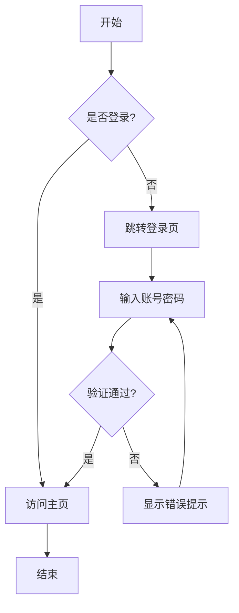

### 1.2 子流程与样式

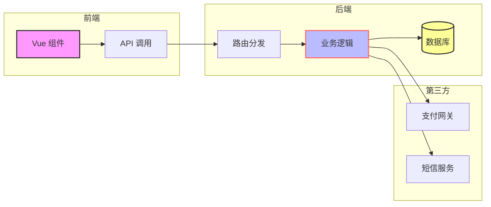

### 1.3 复杂分支

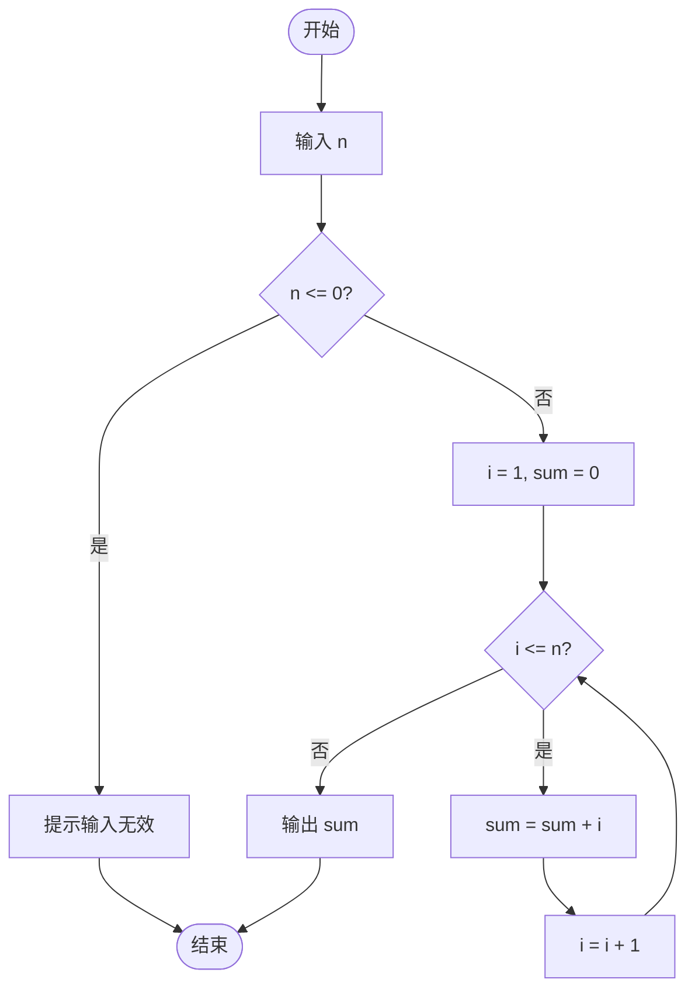

---

## 2. Mermaid 时序图

### 2.1 用户登录时序

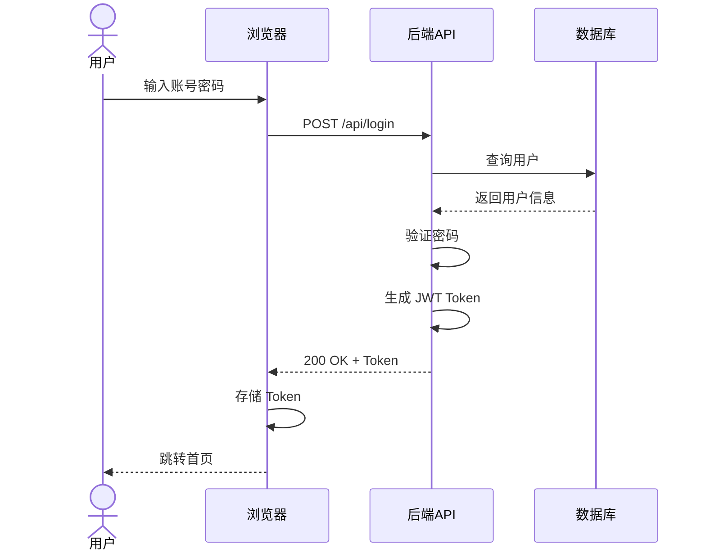

### 2.2 订单流程

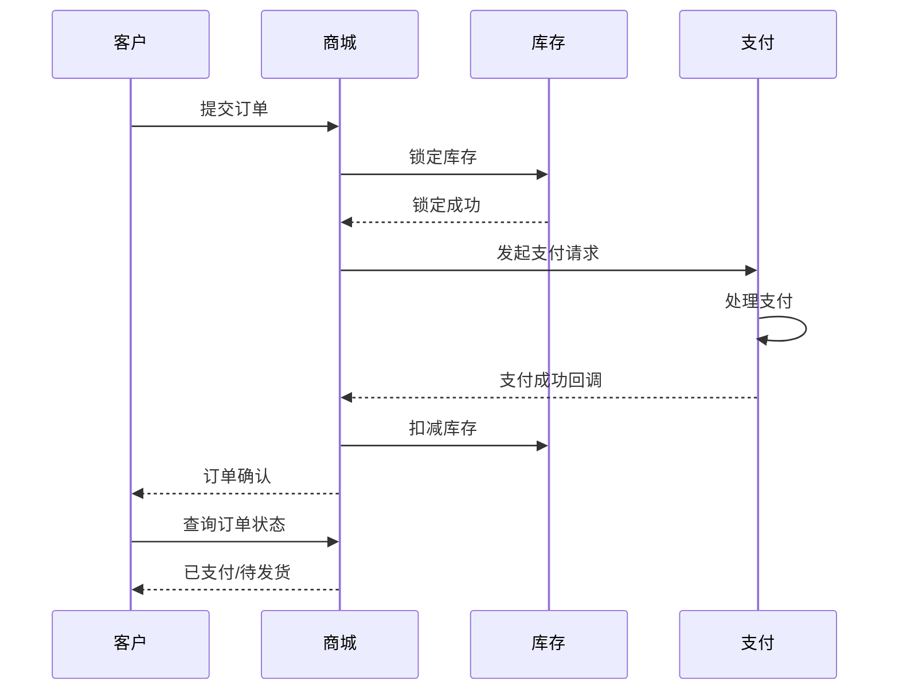

---

## 3. Mermaid 类图

### 3.1 电商系统模型

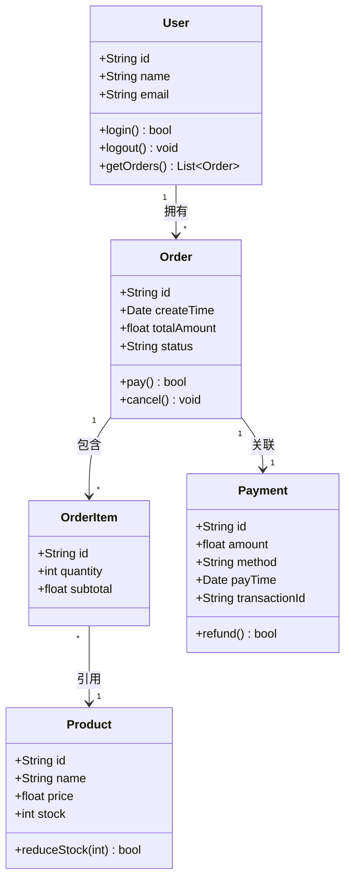

### 3.2 继承与接口

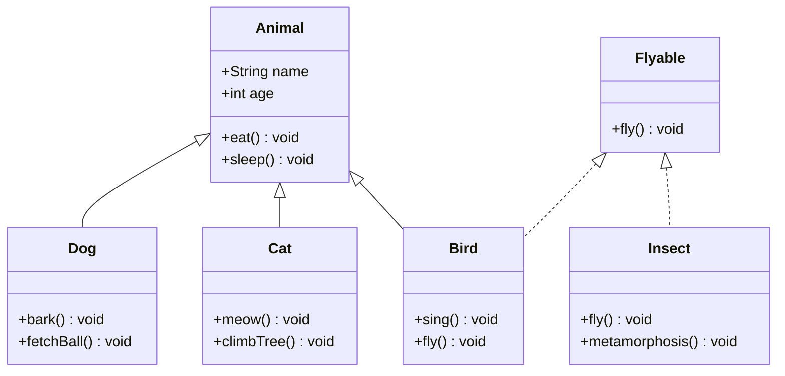

---

## 4. Mermaid 状态图

### 4.1 订单状态流转

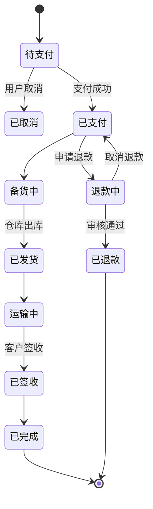

### 4.2 程序生命周期

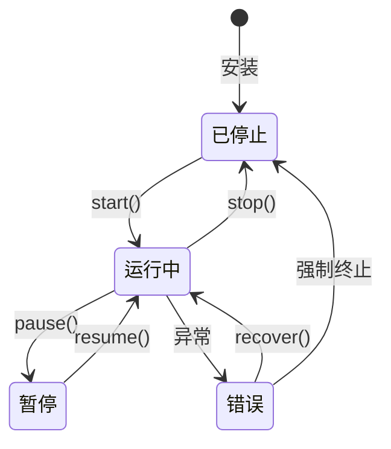

---

## 5. Mermaid 甘特图

### 5.1 项目开发计划

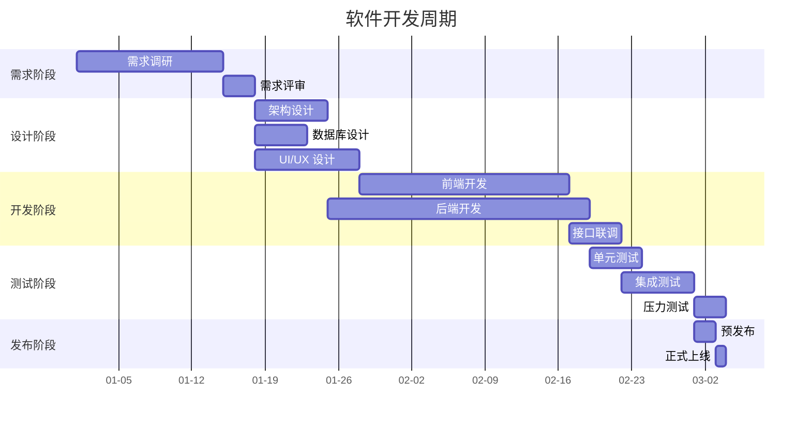

---

## 6. Mermaid 饼图

### 6.1 技术栈分布

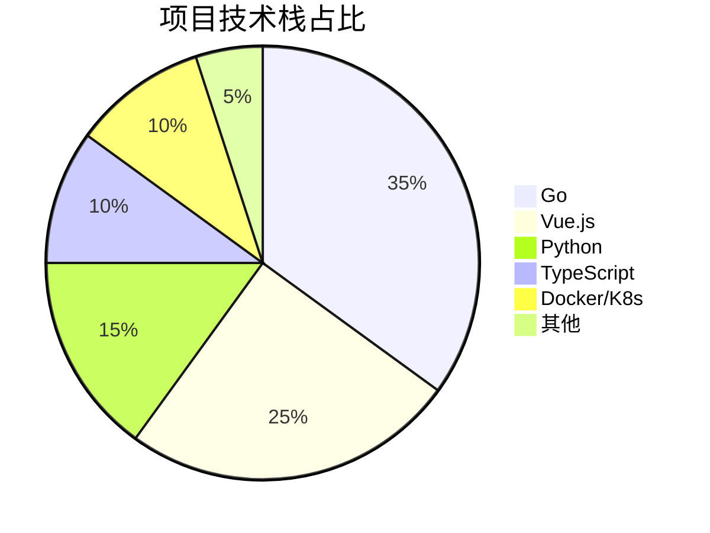

### 6.2 时间分配

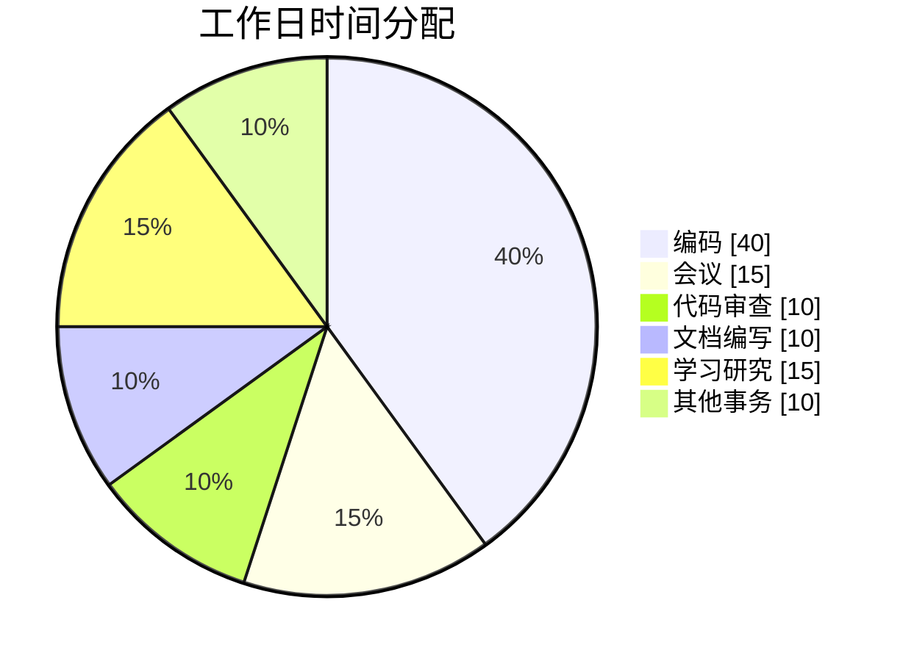

---

## 7. Mermaid ER 图

### 7.1 数据库模型

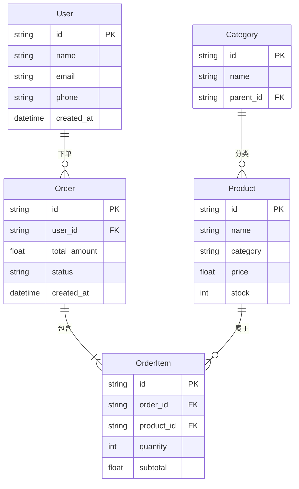

---

## 8. Mermaid 用户旅程图

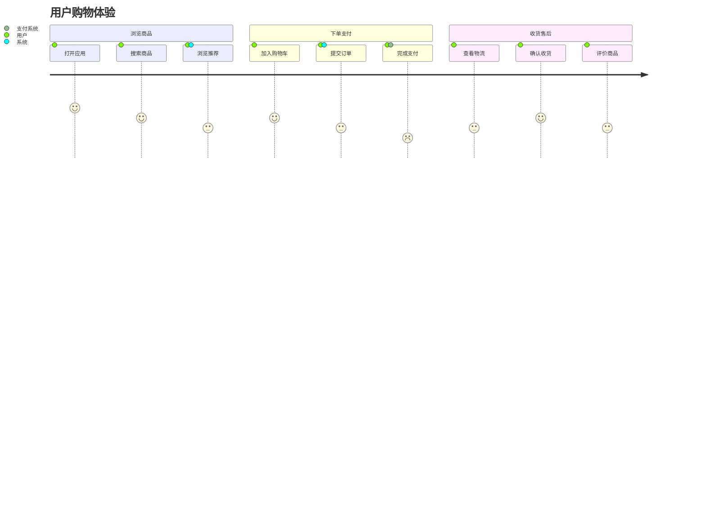

---

## 9. Mermaid 思维导图

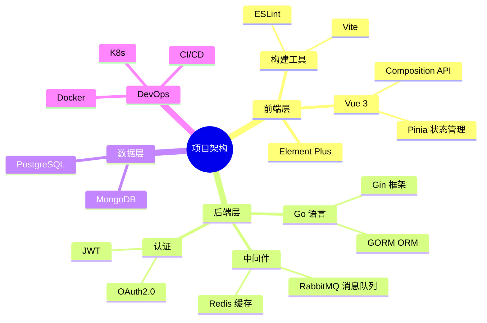

---

## 10. Mermaid Gitgraph

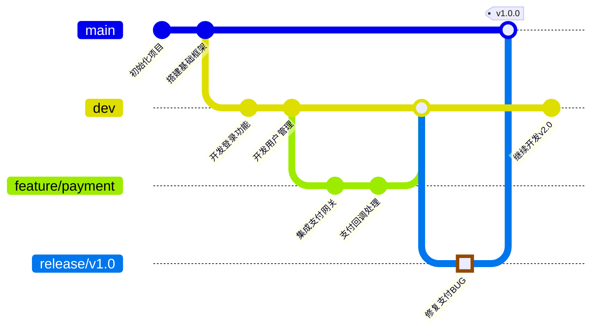

---

## 11. 表格

### 11.1 对齐测试

| 左对齐 | 居中 | 右对齐 | 默认 |
|:-------|:----:|-------:|------|
| 苹果   | 红色 |   ￥5  | 水果  |
| 香蕉   | 黄色 |   ￥3  | 水果  |
| 西瓜   | 绿色 |  ￥15  | 水果  |
| 牛肉   | 红色 |   ￥45 | 肉类  |

### 11.2 带格式表格

| 功能 | 优先级 | 状态 | 负责人 | 预计工时 | 截止日期 |
|:-----|:------:|:----:|:------:|:--------:|:--------:|
| 用户登录 | **P0** | ✅ 已完成 | 张三 | 3d | 2025-01-10 |
| 支付接口 | **P0** | 🔄 开发中 | 李四 | 5d | 2025-01-15 |
| 数据导出 | P2 | ⏳ 待开始 | 王五 | 2d | 2025-01-20 |
| 性能优化 | P1 | ❌ 已阻塞 | 赵六 | 4d | 2025-01-18 |
| ~~旧版迁移~~ | P3 | ~~已取消~~ | - | - | - |

### 11.3 长文本表格

| 模块 | 描述 | 关键技术 | 备注 |
|:-----|:-----|:---------|:-----|
| 认证中心 | 负责用户身份认证、Token 签发与验证、OAuth2.0 第三方登录集成 | JWT, Redis, OAuth2 | 需对接微信/支付宝 |
| 消息队列 | 异步处理订单通知、短信发送、日志采集等非实时任务，削峰填谷 | RabbitMQ, 死信队列 | 消息持久化到磁盘 |
| 网关路由 | 统一入口、限流熔断、请求转发、日志记录、跨域处理 | Gin 中间件, 令牌桶 | 参考 Kubernetes Ingress |

---

## 12. 代码块语法高亮

### 12.1 Go

```go
package main

import (
    "context"
    "fmt"
    "time"
)

// User 结构体
type User struct {
    ID        int64     `json:"id"`
    Name      string    `json:"name"`
    CreatedAt time.Time `json:"created_at"`
}

// Greet 方法
func (u *User) Greet() string {
    return fmt.Sprintf("Hello, I'm %s (ID: %d)", u.Name, u.ID)
}

func main() {
    ctx, cancel := context.WithTimeout(context.Background(), 5*time.Second)
    defer cancel()

    user := &User{ID: 1, Name: "Alice", CreatedAt: time.Now()}
    fmt.Println(user.Greet())

    select {
    case <-ctx.Done():
        fmt.Println("timeout")
    default:
        fmt.Println("done")
    }
}
```

### 12.2 TypeScript

```typescript
import { Component, Vue } from 'vue-property-decorator'
import { UserService } from '@/services/user'

interface ApiResponse<T> {
  code: number
  message: string
  data: T | null
}

@Component
export default class UserList extends Vue {
  private users: Array<{ id: number; name: string }> = []
  private loading = false

  async fetchUsers(): Promise<void> {
    this.loading = true
    try {
      const res = await UserService.list<ApiResponse<any>>()
      if (res.code === 200) {
        this.users = res.data ?? []
      }
    } catch (err) {
      console.error('加载用户失败:', err)
    } finally {
      this.loading = false
    }
  }
}
```

### 12.3 Python

```python
from datetime import datetime
from typing import Optional
import asyncio


class DataProcessor:
    """数据处理基类"""
    
    def __init__(self, name: str, batch_size: int = 100):
        self.name = name
        self.batch_size = batch_size
        self.processed_count = 0
    
    async def process_batch(self, items: list) -> list[dict]:
        """异步批量处理数据"""
        results = []
        for item in items:
            processed = await self._process_single(item)
            results.append(processed)
            self.processed_count += 1
        return results
    
    async def _process_single(self, item) -> dict:
        """单个数据处理（子类实现）"""
        raise NotImplementedError


class JsonProcessor(DataProcessor):
    """JSON 数据处理器"""
    
    async def _process_single(self, item) -> dict:
        return {
            "raw": item,
            "timestamp": datetime.utcnow().isoformat(),
            "length": len(str(item)),
        }


async def main():
    processor = JsonProcessor("json-proc", batch_size=50)
    data = [{"id": i, "value": f"item-{i}"} for i in range(10)]
    results = await processor.process_batch(data)
    print(f"已处理 {processor.processed_count} 条数据")


if __name__ == "__main__":
    asyncio.run(main())
```

### 12.4 SQL

```sql
-- 用户订单统计查询
WITH user_orders AS (
    SELECT
        u.id AS user_id,
        u.name AS user_name,
        COUNT(o.id) AS order_count,
        SUM(o.total_amount) AS total_spent
    FROM users u
    LEFT JOIN orders o ON u.id = o.user_id
    WHERE o.created_at >= '2025-01-01'
    GROUP BY u.id, u.name
    HAVING COUNT(o.id) > 0
),
ranked_users AS (
    SELECT
        *,
        ROW_NUMBER() OVER (ORDER BY total_spent DESC) AS rank
    FROM user_orders
)
SELECT
    rank,
    user_name,
    order_count,
    ROUND(total_spent, 2) AS total_spent
FROM ranked_users
WHERE rank <= 10
ORDER BY rank;
```

### 12.5 JSON

```json
{
  "swagger": "2.0",
  "info": {
    "title": "电商系统 API",
    "version": "1.0.0"
  },
  "paths": {
    "/api/v1/users": {
      "get": {
        "summary": "获取用户列表",
        "parameters": [
          {
            "name": "page",
            "in": "query",
            "type": "integer",
            "default": 1
          },
          {
            "name": "page_size",
            "in": "query",
            "type": "integer",
            "default": 20
          }
        ],
        "responses": {
          "200": {
            "description": "成功返回用户列表",
            "schema": {
              "type": "object",
              "properties": {
                "code": { "type": "integer" },
                "data": {
                  "type": "array",
                  "items": { "$ref": "#/definitions/User" }
                }
              }
            }
          }
        }
      }
    }
  },
  "definitions": {
    "User": {
      "type": "object",
      "properties": {
        "id": { "type": "integer" },
        "name": { "type": "string" },
        "email": { "type": "string" }
      }
    }
  }
}
```

### 12.6 行内代码

在 `Go` 中，使用 `goroutine` 实现并发：`go func() { ... }()`。
通过 `channel` 通信：`ch := make(chan struct{})`。
错误处理使用 `if err != nil { return err }` 模式。

---

## 13. 数学公式

### 13.1 内联公式

勾股定理：$a^2 + b^2 = c^2$
欧拉公式：$e^{i\pi} + 1 = 0$
正态分布：$X \sim \mathcal{N}(\mu, \sigma^2)$

### 13.2 块级公式

$$
\frac{-b \pm \sqrt{b^2 - 4ac}}{2a}
$$

$$
\int_{-\infty}^{\infty} e^{-x^2} \, dx = \sqrt{\pi}
$$

$$
\sum_{n=1}^{\infty} \frac{1}{n^2} = \frac{\pi^2}{6}
$$

$$
\mathbf{H} = \begin{pmatrix}
\frac{\partial^2 f}{\partial x_1^2} & \frac{\partial^2 f}{\partial x_1 \partial x_2} \\
\frac{\partial^2 f}{\partial x_2 \partial x_1} & \frac{\partial^2 f}{\partial x_2^2}
\end{pmatrix}
$$

---

## 14. HTML 内嵌图形

> 以下用 HTML 模拟进度条、色块、布局等图形效果（部分 Markdown 渲染器支持）

<div style="display: flex; gap: 20px; flex-wrap: wrap;">

<div style="flex: 1; min-width: 200px; padding: 15px; border: 1px solid #ddd; border-radius: 8px;">

### 进度条

<div style="background: #eee; border-radius: 10px; padding: 3px; margin: 10px 0;">
  <div style="width: 80%; height: 20px; background: linear-gradient(90deg, #4CAF50, #8BC34A); border-radius: 8px; text-align: center; line-height: 20px; color: #fff; font-size: 12px;">80%</div>
</div>

<div style="background: #eee; border-radius: 10px; padding: 3px; margin: 10px 0;">
  <div style="width: 45%; height: 20px; background: linear-gradient(90deg, #FF9800, #FFC107); border-radius: 8px; text-align: center; line-height: 20px; color: #fff; font-size: 12px;">45%</div>
</div>

<div style="background: #eee; border-radius: 10px; padding: 3px; margin: 10px 0;">
  <div style="width: 15%; height: 20px; background: linear-gradient(90deg, #F44336, #E91E63); border-radius: 8px; text-align: center; line-height: 20px; color: #fff; font-size: 12px;">15%</div>
</div>

</div>

<div style="flex: 1; min-width: 200px; padding: 15px; border: 1px solid #ddd; border-radius: 8px;">

### 色卡

<div style="display: flex; gap: 5px; flex-wrap: wrap;">
  <div style="width: 40px; height: 40px; background: #F44336; border-radius: 4px;" title="红色 #F44336"></div>
  <div style="width: 40px; height: 40px; background: #FF9800; border-radius: 4px;" title="橙色 #FF9800"></div>
  <div style="width: 40px; height: 40px; background: #FFEB3B; border-radius: 4px;" title="黄色 #FFEB3B"></div>
  <div style="width: 40px; height: 40px; background: #4CAF50; border-radius: 4px;" title="绿色 #4CAF50"></div>
  <div style="width: 40px; height: 40px; background: #2196F3; border-radius: 4px;" title="蓝色 #2196F3"></div>
  <div style="width: 40px; height: 40px; background: #9C27B0; border-radius: 4px;" title="紫色 #9C27B0"></div>
  <div style="width: 40px; height: 40px; background: #795548; border-radius: 4px;" title="棕色 #795548"></div>
  <div style="width: 40px; height: 40px; background: #607D8B; border-radius: 4px;" title="蓝灰 #607D8B"></div>
</div>

</div>

</div>

---

## 15. 嵌套列表与任务列表

### 15.1 多级嵌套

- 编程语言
  - 编译型
    - Go
    - Rust
    - C/C++
  - 解释型
    - Python
    - JavaScript
      - ES6+
      - TypeScript
    - Ruby
- 数据库
  - 关系型
    1. PostgreSQL
    2. MySQL
    3. SQLite
  - NoSQL
    1. MongoDB
    2. Redis
    3. Elasticsearch

### 15.2 任务列表

- [x] 完成架构设计
- [x] 实现用户登录模块
- [ ] 集成支付接口
  - [x] 支付宝对接
  - [ ] 微信支付对接
- [ ] 编写 API 文档
- [ ] 部署测试环境
  - [x] 申请服务器
  - [ ] 配置域名
  - [ ] 部署 Docker 容器

### 15.3 混合列表

1. 第一阶段：基础设施
   - [x] 搭建开发环境
   - [x] 配置 CI/CD 流水线
   - [ ] ~~购买独立服务器~~（改用云服务）
2. 第二阶段：核心功能
   - [x] 用户认证
   - [ ] 商品管理
     - 商品 CRUD 接口
     - 商品搜索（需要 Elasticsearch）
3. 第三阶段：上线准备
   - [ ] 压力测试
   - [ ] 安全审计

---

## 引用与分隔线

### 引用嵌套

> **《道德经》**
>
> 道可道，非常道；名可名，非常名。
>
> > 无名天地之始，有名万物之母。
> >
> > > 故常无欲，以观其妙；常有欲，以观其徼。

### 分隔线变体

普通分隔线：

---

带星号分隔线：

***

带下划线分隔线：

___

---

## 脚注与链接

这是一段需要脚注的文字[^1]，这里还有另一个脚注[^2]。

[^1]: 这是第一个脚注的内容。
[^2]: 这是第二个脚注的内容，可以包含**格式**和`代码`。

---

## 图片与媒体

### 占位图测试


### SVG 内嵌

> 以下是用 Markdown 直接写的 SVG 图形（部分渲染器支持）

```svg
<svg width="300" height="100" xmlns="http://www.w3.org/2000/svg">
  <rect x="10" y="10" width="280" height="80" rx="10" fill="#f0f0f0" stroke="#333" stroke-width="2"/>
  <text x="150" y="50" font-family="Arial" font-size="20" text-anchor="middle" fill="#333">
    内嵌 SVG 文本
  </text>
  <circle cx="50" cy="75" r="8" fill="#4CAF50"/>
  <circle cx="150" cy="75" r="8" fill="#FF9800"/>
  <circle cx="250" cy="75" r="8" fill="#F44336"/>
</svg>
```

---

## 总结

| 测试项 | 状态 | 备注 |
|:-------|:----:|:-----|
| Mermaid 流程图 | 🔲 | 需渲染器支持 mermaid 块 |
| Mermaid 时序图 | 🔲 | 同上 |
| Mermaid 类图 | 🔲 | 同上 |
| Mermaid 状态图 | 🔲 | 同上 |
| Mermaid 甘特图 | 🔲 | 同上 |
| Mermaid 饼图 | 🔲 | 同上 |
| Mermaid ER 图 | 🔲 | 同上 |
| 表格对齐 | 🔲 | 标准 Markdown |
| 代码高亮 | 🔲 | 需语法高亮引擎 |
| 数学公式 | 🔲 | 需 KaTeX/MathJax |
| HTML 内嵌 | 🔲 | 部分渲染器支持 |
| 嵌套列表 | 🔲 | 标准 Markdown |
| 任务列表 | 🔲 | GFM 扩展 |
| SVG 内嵌 | 🔲 | 部分渲染器支持 |

> ⚠️ 说明：请根据你的 Markdown 渲染器实际能力，在上述表格中填入 ✅ 或 ❌。

---

*测试文档结束 · 共包含 10 类 Mermaid 图形 + 表格 + 代码高亮 + 公式 + HTML 图形 + 列表嵌套*
